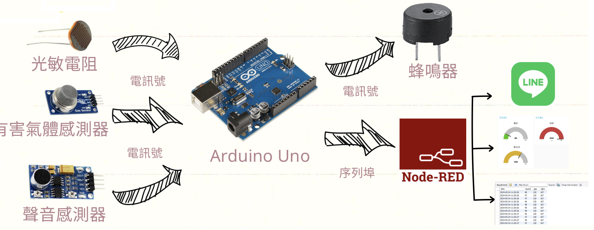
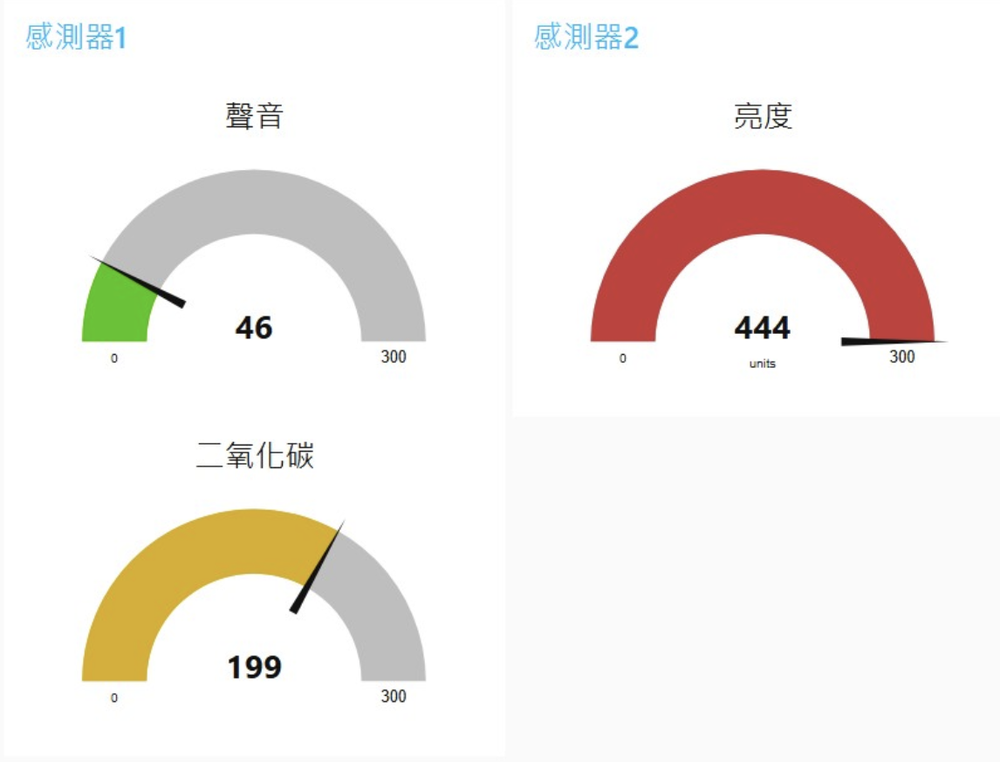
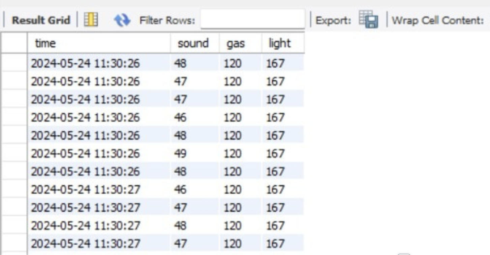

# Sleep-Quality-Monitoring-System

The **Sleep-Quality-Monitoring-System** is an infant sleep monitoring device that integrates a photoresistor, harmful gas sensor, and sound sensor. This system analyzes sleep conditions in real-time, displays data on a Node-RED interface, stores sensor measurements in a MySQL database, and sends notifications to the user’s LINE account to provide quick insights into sleep quality.

## Project Overview

Monitoring the sleep quality of infants requires close tracking of the surrounding environment. This project captures three critical factors that impact sleep quality:

1. **Light Levels**: Detected by a photoresistor to monitor brightness in the infant's environment.
2. **Gas Levels**: A harmful gas sensor ensures the air quality is safe for the infant.
3. **Noise Levels**: A sound sensor tracks noise levels, detecting potential disturbances that could interrupt sleep.

Each of these elements is collected in real-time and processed to provide a comprehensive analysis of sleep quality.

## System Components and Data Flow

The **Sleep-Quality-Monitoring-System** consists of the following key components:

- **Microcontroller**: Programmed in `SleepMonitor.c`, the microcontroller manages the collection and processing of sensor data, controlling the sleep monitoring functions.
  
- **Node-RED Interface**: The Node-RED interface displays sensor data in real time, offering the user an immediate view of the infant’s sleep environment. This graphical interface is essential for monitoring trends and quickly assessing conditions.

  

- **MySQL Database**: All sensor data collected by the device is stored in a MySQL database, creating a record that can be referenced for historical analysis. The database enables long-term tracking of environmental conditions and sleep quality.

  

- **LINE Notifications**: For enhanced convenience, the system automatically sends notifications to the user’s LINE account. This feature provides timely insights, helping caregivers respond promptly to any changes in the infant’s sleep environment.

  

## Files

- **flows.json**: Contains the configuration for Node-RED, enabling real-time data visualization and display.
- **SleepMonitor.c**: The core microcontroller program, responsible for gathering and processing data from the sensors.

With this structure, the **Sleep-Quality-Monitoring-System** provides caregivers with reliable, actionable information about the infant's sleep environment, facilitating better monitoring and faster responses to any changes.
